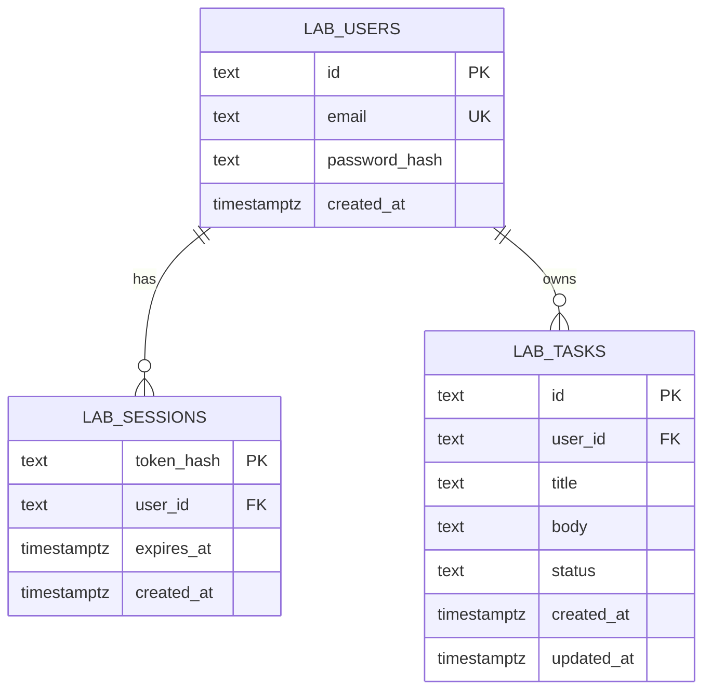

# /lab — planning doc

A live one-screen demo that composes `PS-safe/auth`, `PS-safe/mailer`, and
`PS-safe/queryhelper` (TS ports against Neon, same pattern as the other
in-portfolio runtime ports) into a small SaaS-shape product. Lives at
`/lab` inside the portfolio.

This doc is drafted top-down. Each section locks before the next is
filled in. Drift detected mid-build comes back here, not into the code.

---

## 1. Audience + success criterion

**Audience.** A senior engineer / staff engineer / engineering manager at
a target employer, looking at the portfolio to evaluate whether they'd
want to interview the author.

**What they will actually do.** Land on `/lab`. Skim the page. Maybe sign
up (~30s — depends on perceived risk). Click around for ~2 minutes. Open
the GitHub repo at `PS-safe/portfolio` and read the relevant files in
`app/lab/` and `lib/lab/`. If they like what they see, they may also open
one or more of the dependent libraries (`PS-safe/auth`, etc.).

**Success criterion (one sentence, write-or-die).**

> When a senior engineer at a target employer visits `/lab`, signs up,
> uses the dashboard for two minutes, and reads the source on GitHub —
> they walk away thinking *"this person has the production instincts of
> a mid-senior backend engineer **and** can ship a polished frontend
> without an army."*

Two claims, both need evidence from the artifact:

| Claim | Where it shows up |
|---|---|
| **Production instincts (backend)** | Auth posture (Argon2id, opaque tokens, generic 401s, anti-enumeration). Rate limits on credential endpoints. Allowlist on filterable fields. Sensible data model. Errors that don't leak. Comments that explain *why*. |
| **Polished frontend without an army** | Visual taste. Mobile responsive. Empty/loading/error states. Keyboard-navigable. Accessible focus paths. Lighthouse ≥ 90 on Performance + Accessibility. UI quality that matches Linear / Vercel dashboard / Cron tier. |

**Anti-goal.** Don't optimize for "recruiter skim" / Instagram-screenshot
appeal. That audience would point us toward animation and density; this
audience would point at it and ask "why is your hero doing a parallax."

**Out-of-scope as success metric.** Real users. Real revenue. Long-form
docs. Multi-page narrative. The artifact is the artifact.

---

## 2. Scope lock — v1 IN / OUT

**IN (must ship for v1 to be defensible).**

- Email + password signup, login, logout
- Argon2id password hashing (matches `PS-safe/auth` parameters)
- Opaque session token (sha256(token) in DB) in an HttpOnly + Secure +
  SameSite=Lax cookie, 7-day TTL
- Generic 401 on bad credentials (no enumeration)
- Rate-limit signup + login (~5/min/IP, shared bucket via `lib/ratelimit`)
- **Per-user task list** in `lab_tasks` (each row has a `user_id` FK to
  `lab_users`). No automatic seeding on signup — a fresh account lands
  on an empty dashboard and creates their own tasks.
- **Task CRUD in UI** — create, edit, delete. Completes the demo loop:
  empty state → user creates their first task → dashboard fills →
  filter/search/sort/paginate become meaningful. This is the change
  from the earlier draft that put CRUD in OUT; it's been promoted so
  the demo can stand on its own without seeding.
- Dashboard over the per-user list:
  - Filter chips (status: active / pending / archived; multi-select)
  - Free-text search across `title` + `body` (case-insensitive)
  - Sort dropdown (created_at desc/asc, title a–z/z–a)
  - Pagination (8/page, paged controls)
- Mobile responsive: works at 360px, 768px, 1024px+
- Three explicit UI states everywhere: **empty / loading / error**
- Keyboard-navigable end to end (tab order, focus visible, Esc closes
  modals if any)
- Three tables added to Neon: `lab_users`, `lab_sessions`, `lab_tasks`
- Inline link from `/lab` page to the three composed library repos so
  readers can trace the pieces


**OUT (deferred, for v2 or never).**

- Email verification on signup — OTP demo already proves the flow
- Password reset — `PS-safe/auth` covers the design; not demoed here
- OAuth providers, magic-link login, WebAuthn
- Multi-step task editing (drag-and-drop reorder, batch operations,
  inline-rename) — single-row CRUD covers the demo; richer interactions
  are v2 polish
- Sharing, comments, real-time updates, file uploads
- Multi-tenant features (orgs, roles per org)
- Account deletion / GDPR-style data export (mention in README as known gap)
- Demo-data cleanup cron (note in README; eventually sweeps demo
  accounts older than N days from `lab_users` + `lab_sessions` +
  `lab_tasks`)
- Notifications, in-product onboarding tour
- Anything that needs another deployment (workers, queues, schedulers)

**Explicit non-goals worth naming.**

- *Not* a real product. Nothing here is marketed to users.
- *Not* a portfolio of UI patterns. One coherent screen beats a tour.
- *Not* a UI library. Components live with the page; if any earn
  reusability they graduate to a separate repo later.

**Risk to scope (refined and promoted to §10 risk register).**

The original three risks survived the §3–§9 drafting with refinements:

1. **Scope creep, *especially per-task field expansion.*** With CRUD
   in, the natural next-asks become "add due date, priority,
   categories, subtasks." Each field ripples into form, validation, DB
   column, filter chip, sort key. Gate is the IN list above.
2. **Style discontinuity** (flipped from "monotony"). §5's tonal-break
   decision actively fixes monotony but introduces the opposite risk:
   /lab could read as a different site. Mitigated by shared tokens +
   the auth-panel hero keeping `<HeroSpotlight>` so the *entrance* to
   /lab feels like portfolio before the dashboard goes calm.
3. **Argon2 cold-start UX.** First signup on a cold Vercel function
   pays the full path: ~500ms-1s function cold-start + ~100-300ms
   native-binding init + 1.5-2.5s first hash = **2.5-4s worst case**.
   **Decision: accept the cost, lean into copy** — "Setting up secure
   password storage…" instead of "Creating your account…" so the wait
   reads as deliberate. Argon2 parameters stay matched to PS-safe/auth
   (m=64MiB, t=3, p=2); do NOT relax them.

Five additional risks emerged during §3–§9 drafting (signup
enumeration, demo-data accumulation, native-binding stability,
CLAUDE.md CWD discipline, Stop-hook latency). Full set tracked in §10.

**Signup enumeration — deliberate accept.** The `POST /signup` endpoint
in §6 returns `409` if the email is already registered, which leaks
which emails have accounts. **Accepted with documentation** rather
than fixed: a production system would route this through
`mailer`-driven "verify or recover" emails (the public real-product
answer); /lab is a demo and explicitly says so on-page. The trade-off
is itself part of what a senior reviewer is asked to evaluate.

---

**§1 + §2 locked 2026-05-16.** Anything that changes here from this
point forward goes in via a noted amendment, not a silent edit.

---

## 3. Reference / inspiration board

The audience (senior engineer / CTO at a target employer) reads polish
the way they read code: by noticing absence of friction. Skipping
delight is fine; sloppy delight isn't. References are picked for taste,
not for things to copy verbatim.

| Reference | What to steal | What NOT to steal |
|---|---|---|
| **Linear** (linear.app — issue list, command bar) | Calm density, exact spacing, status chips, keyboard-first interaction, table row hover, filter-chip multi-select | The full keyboard command vocabulary; the assignee/cycle taxonomy |
| **Vercel dashboard** (vercel.com/dashboard — deployments) | Mono+sans pairing, accent restraint, table rows as primary surface, breadcrumbs over hero, loading skeletons | Their info density (we have less data); the team-switcher |
| **Stripe dashboard** (dashboard.stripe.com — payments table) | Enterprise polish reference: filter bar above the table, "applied filters" chips with x-to-remove, save-view affordance, sort indicators | Anything color-coded by money; the side-rail |
| **Raycast** (raycast.com — preferences, extensions) | Interaction quality, hover/focus rings, modal feel, accent blue done well in dark mode | The fully-controlled extension grid; the gradient hero |
| **Plausible Analytics** (plausible.io/<domain> — analytics view) | Restrained data viz, single accent, mobile responsiveness on a dense surface | Anything chart-shaped (we have no charts in v1) |

**Three explicit do-NOTs from this board:**
- No team / org / assignee concept (Linear, Stripe). One user, one
  task list.
- No charts / sparklines / numbers-go-up cards (Vercel, Plausible). The
  demo is filter+search+sort+CRUD, not analytics.
- No gradient hero / marketing-page motion (Raycast). The dashboard
  surface is calm.

---

## 4. Information architecture

**Routes.**

| Route | Type | Renders |
|---|---|---|
| `/lab` | RSC | Reads `lab_session` cookie. **Not signed in:** auth panel. **Signed in:** dashboard. One route, two states. |

That's it. No `/lab/login`, no `/lab/dashboard`, no `/lab/[id]`. One
URL, two rendered states. Auth flow stays in-place so the user never
loses the page they came in on.

**API endpoints (all under `/api/lab`).**

| Method | Path | Auth | Purpose |
|---|---|---|---|
| `POST` | `/signup` | ❌ | Create user, open session, set cookie. Rate-limited (5/min/IP, shared bucket with `/login`). |
| `POST` | `/login` | ❌ | Verify creds, open session, set cookie. Generic 401 on any failure. Same rate-limit bucket. |
| `POST` | `/logout` | ✓ (cookie) | Delete session, clear cookie. 204. |
| `GET` | `/me` | ✓ | Return `{user}` or `{user: null}`. Used by the page for "am I signed in" check. |
| `GET` | `/tasks` | ✓ | Paginated list. Query params: `page`, `page_size`, `search`, `order`, `status`. Allowlist enforced. |
| `POST` | `/tasks` | ✓ | Create. Body `{title, body, status}`. Returns created row. |
| `PATCH` | `/tasks/[id]` | ✓ | Partial update. Body any of `{title, body, status}`. Authorization checks `user_id` match. |
| `DELETE` | `/tasks/[id]` | ✓ | Delete. 204 on success, 404 if not owned. |

**Navigation.** Add `/lab` to `site-nav.tsx`. Order: `Home · Projects ·
Lab · About · Contact`. "Lab" sits between Projects and About — it's a
companion to Projects, but distinct (live demo, not docs).

**State / data flow on `/lab`.**

- **Page itself is a Server Component.** Reads the cookie, looks up the
  session, fetches the initial tasks page for the default filters.
  Renders HTML with data — no client-side waterfall on first load.
- **Filter / search / sort / page changes update the URL** via
  `router.replace(?status=active&order=-created_at)`. The RSC re-renders
  with new tasks. This makes the dashboard view shareable and
  refresh-safe.
- **Create / edit / delete are client mutations** via fetch to
  `/api/lab/tasks`. Optimistic UI: row appears/updates/removes
  immediately; server response confirms or reverts.
- **Search has a 250ms debounce** so each keystroke doesn't round-trip.

**Auth flow shape on `/lab`.**

- Single panel with a `signup ⇄ login` tab toggle at the top.
- Email + password fields. Min 8 chars on signup (enforced both
  client-side hint and server-side validation).
- One button, label varies: "Create account" or "Sign in".
- Below the button: a small note that this is a demo, links to the
  three composed library repos so a reader can trace the pieces before
  signing up.
- Loading state on submit (button shows spinner + label changes to
  "Creating your account…" / "Signing in…"). Critical for argon2
  cold-start UX — see §2 risk #3.
- Error renders inline below the form, accent-red, role="alert".

---

## 5. Visual language decision

**Decision: tonal break, shared vocabulary.** /lab reuses the portfolio's
design tokens (the accent blue, the type stack, the dark/light theming)
but adopts a **calmer, denser surface** that fits a dashboard better than
the showcase tone of `/`, `/projects`, `/about`. Same family of palette,
different room.

| Aspect | Portfolio (existing) | `/lab` |
|---|---|---|
| Ambient blue glow | Fixed orbs behind page | Off (or much fainter — dashboard surfaces are flatter) |
| Hero spotlight on H1 | Yes — cursor-tracking gradient text | Only on the auth-panel hero; the signed-in dashboard has a small, static page title |
| 3D tilt on cards | Yes — project cards lift on hover | Off — task rows are tabular, tilt would feel toy-like |
| Hover treatment | Glow + lift | Subtle background tint, accent left-border on row hover |
| Spacing | Generous (`py-16`, `py-20`) | Tighter (`py-8`–`py-12`); 12px row gutters |
| Loading | Reveal stagger on mount | Skeleton placeholders (Linear/Vercel style) |
| Sort/filter controls | n/a | Compact, accent on active state, ghost on inactive |

**Status chips — semantic colors, used sparingly.**

| Status | Light | Dark | Why |
|---|---|---|---|
| `active` | accent blue (`#2563eb`) | accent blue dark (`#60a5fa`) | Reuses the brand accent — active items get the "live" treatment |
| `pending` | amber `#d97706` | amber `#fbbf24` | Universal "waiting / in-flight" reading. The one non-accent color we introduce. |
| `archived` | muted-foreground (`#52525b`/`#a1a1aa`) | same | Receded; greyed out by design |

Three colors total on `/lab` surfaces (accent, amber, muted). No
additional palette expansion. Other dashboards use 5–7 semantic colors;
we stay restrained because the dataset is one entity.

**Motion vocabulary (the explicit list).**

- Chip click: 120ms color + 1px scale-down on press
- Search input focus: existing accent ring (no other motion)
- Sort dropdown: native `<select>` or headless equivalent — no custom
  animation; senior reviewers notice when basic controls are
  re-invented badly
- Add Task button: `transition-opacity` on hover (already in portfolio
  conventions), no lift
- Modal open: `opacity 0 → 1` and `scale 0.97 → 1` over 140ms; ease-out
- Row delete: 160ms `opacity 1 → 0` and `height collapse`; neighbours
  shift up via CSS grid auto-flow
- Page change: skeleton placeholders during fetch, no slide/fade between
  pages

All motion respects `prefers-reduced-motion` (existing portfolio
convention).

**Typography unchanged.** Geist Sans + Geist Mono. Mono for IDs,
timestamps, code-y bits. Sans for everything else.

**Accessibility floor (so it's locked, not negotiated mid-implementation).**

- All interactive controls reachable by `Tab`, in visual order
- Focus rings always visible on `:focus-visible` (existing global rule
  already does this)
- Modal trap-focus when open; Esc closes
- Filter chips, sort selector, search use proper aria roles
  (`aria-pressed` on chips, `aria-label` on search)
- Color is never the sole carrier of status — each status chip has a
  text label and a leading dot
- Lighthouse Accessibility ≥ 90 is the bar (same as Perf from §1).
  Lighthouse only catches ~30–40% of real WCAG issues, so 90 means "no
  obvious automated failures"; the rest is covered by manual keyboard-
  only nav + a screen-reader spot-check before shipping.

**§3 + §4 + §5 locked 2026-05-16.** Amendments noted below if changes
arrive later.

## 6. Data model + API contract

### Schema

Three tables, all under the `lab_` prefix so the demo's data is visibly
namespaced separately from `links`, `otps`, `rate_limit_events`.



### Migration (one-shot, run in Neon SQL Editor before first deploy)

```sql
-- /lab demo schema. Idempotent; safe to re-run.

CREATE TABLE IF NOT EXISTS lab_users (
    id            TEXT        PRIMARY KEY,
    email         TEXT        NOT NULL UNIQUE,
    password_hash TEXT        NOT NULL,
    created_at    TIMESTAMPTZ NOT NULL DEFAULT now()
);
CREATE INDEX IF NOT EXISTS idx_lab_users_email_lower ON lab_users (lower(email));

CREATE TABLE IF NOT EXISTS lab_sessions (
    token_hash  TEXT        PRIMARY KEY,
    user_id     TEXT        NOT NULL REFERENCES lab_users(id) ON DELETE CASCADE,
    expires_at  TIMESTAMPTZ NOT NULL,
    created_at  TIMESTAMPTZ NOT NULL DEFAULT now()
);
CREATE INDEX IF NOT EXISTS idx_lab_sessions_user_id    ON lab_sessions (user_id);
CREATE INDEX IF NOT EXISTS idx_lab_sessions_expires_at ON lab_sessions (expires_at);

CREATE TABLE IF NOT EXISTS lab_tasks (
    id          TEXT        PRIMARY KEY,
    user_id     TEXT        NOT NULL REFERENCES lab_users(id) ON DELETE CASCADE,
    title       TEXT        NOT NULL,
    body        TEXT,
    status      TEXT        NOT NULL DEFAULT 'active'
                  CHECK (status IN ('active','pending','archived')),
    created_at  TIMESTAMPTZ NOT NULL DEFAULT now(),
    updated_at  TIMESTAMPTZ NOT NULL DEFAULT now()
);
CREATE INDEX IF NOT EXISTS idx_lab_tasks_user_created ON lab_tasks (user_id, created_at DESC);
CREATE INDEX IF NOT EXISTS idx_lab_tasks_user_status  ON lab_tasks (user_id, status);
```

**Notes on the schema:**

- `lab_users.email` UNIQUE forces "one account per address." Postgres
  uniqueness is case-sensitive, so we **store lowercase** at write time
  (handler responsibility) and read via `lower(email) = lower(?)` on
  login (helper covers it). The functional index on `lower(email)` keeps
  that lookup O(1).
- `password_hash` carries the full PHC-encoded argon2id string
  (`$argon2id$v=19$m=…$…$…`). Verify reads parameters from the encoded
  hash, not from app config — rotating cost params later doesn't break
  old hashes.
- `lab_sessions.token_hash` is `sha256(raw_token)`. Raw token leaves the
  server exactly once, in the Set-Cookie header.
- `ON DELETE CASCADE` on both children: deleting a user removes their
  sessions and tasks atomically. Matters when we add account deletion
  later.
- `lab_tasks.status` carries a `CHECK` constraint. The enum is short
  enough that a check beats a separate `lab_task_statuses` table; if it
  ever grows, the table goes in.
- `updated_at` is set on every UPDATE (handler maintains it; we don't
  use a trigger because portability beats elegance for a demo).
- Indexes match the only two real query shapes we'll run: list-by-user
  ordered by created_at, and filter-by-status within a user. A GIN/trgm
  index for the `LIKE` search is over-engineering for a demo — Postgres
  will sequential-scan a few hundred rows fast enough.

### API contract

All routes live under `/api/lab`. Error envelope is consistently
`{ "error": "human-readable string" }`. Auth check is "valid session
cookie present" except where noted.

| Method | Path | Auth | Request body | Success | Failure modes |
|---|---|---|---|---|---|
| `POST` | `/signup` | ❌ | `{email, password}` | `201 {user: {id, email, created_at}}` + Set-Cookie | `400` invalid email / weak password · `409` email taken (deliberate; see §2 R4 — enumerable, accepted for demo) · `429` rate-limited |
| `POST` | `/login` | ❌ | `{email, password}` | `200 {user}` + Set-Cookie | `401` invalid credentials (generic) · `429` rate-limited |
| `POST` | `/logout` | cookie | _(empty)_ | `204` + cleared cookie | _(always succeeds; idempotent)_ |
| `GET`  | `/me` | optional | _(query)_ | `200 {user}` or `200 {user: null}` | _(never errors; "not signed in" is `null`, not 401)_ |
| `GET`  | `/tasks` | ✓ | _(query string)_ | `200 {items, total, page, page_size, total_pages}` | `400` unknown filter/sort field · `401` no/expired session |
| `POST` | `/tasks` | ✓ | `{title, body?, status?}` | `201 {task}` | `400` validation · `401` |
| `PATCH`| `/tasks/[id]` | ✓ | `{title?, body?, status?}` | `200 {task}` | `400` no fields / invalid value · `401` · `404` not owned |
| `DELETE`| `/tasks/[id]` | ✓ | _(empty)_ | `204` | `401` · `404` not owned |

**Validation table** — boundaries enforced in route handlers, mirrored
client-side as hint-only:

| Field | Rule |
|---|---|
| `email` | Trimmed, lowercased, `looksLikeEmail` check (≤ 254 chars, has `@`, has `.` after `@`) |
| `password` | ≥ 8 chars, no upper-bound (argon2id handles long inputs) |
| `task.title` | Trimmed, 1–200 chars |
| `task.body` | Optional, 0–2000 chars |
| `task.status` | Must be one of `active` / `pending` / `archived` |
| `?page` | Positive integer, ≥ 1 |
| `?page_size` | Positive integer, clamped to ≤ 50 (hard cap; default 8) |
| `?status` (filter) | Comma- or repeat-separated; each value validated against the enum |
| `?order` | One or more of `created_at`, `-created_at`, `title`, `-title`, `status`, `-status` |
| `?search` | Trimmed; empty becomes "no search" |

**Authorization rules.**

- Every `/tasks*` route reads the session cookie, looks up
  `lab_sessions` for an unexpired row, joins to `lab_users`. If
  anything is missing, **401**. The lookup is one round trip (one
  SELECT with a JOIN, mirrors `PS-safe/auth`'s `SessionByTokenHash`).
- `PATCH` and `DELETE` on `/tasks/[id]` add a second check: the task's
  `user_id` must match the session's `user_id`. **A foreign user
  guessing an ID gets a 404 (not 403)** so they can't probe which IDs
  exist on other accounts.
- Rate-limit on `signup` + `login` shares one bucket per IP via the
  existing `lib/ratelimit` (`demo:lab:credentials` key, 5/min).

---

## 7. Component inventory

What carries from the portfolio vs net-new for /lab. **Goal: don't
reinvent — your portfolio already has 60% of what /lab needs.**

### Reused (no new code)

| Asset | Where it lives | What /lab uses it for |
|---|---|---|
| Theme tokens (CSS vars) | `app/globals.css` | All color, border, accent — light/dark inherits |
| Type stack (Geist Sans + Mono) | `app/layout.tsx` | All text |
| `:focus-visible` ring | `app/globals.css` | Already universal — keyboard a11y bar mostly free |
| Themed scrollbar | `app/globals.css` | Dashboard list area |
| `<HeroSpotlight>` | `components/hero-spotlight.tsx` | Auth-panel hero only — NOT on the dashboard |
| Site nav + footer | `components/site-nav.tsx` + footer | Inherits from layout; just add a new nav link |
| `lib/db.ts`, `lib/ratelimit.ts` | existing | Neon client + rate-limit helpers |
| Lucide icons + `GithubIcon` | `lucide-react` + `components/icons.tsx` | All icons (no new icon set) |

### Deliberately NOT reused

| Asset | Why |
|---|---|
| `<TiltCard>` | Tables can't be toys (per §5) |
| Ambient `.page-ambient` orbs | Dashboard surface is flatter (per §5) |
| `<ProjectCard>` look | Different surface — task rows, not pitch cards |
| `<Mermaid>` | No diagrams on the /lab page itself |
| `<TryShortenForm>` etc. | Those are MDX widgets; /lab isn't MDX |

### Net-new components

Sized small on purpose — each does one thing and stays under ~120 LOC.

| # | Component | Server / Client | Purpose |
|---|---|---|---|
| 1 | `<AuthPanel>` | client | Signup ⇄ login tab toggle, email/password form, inline error, loading state with argon2-aware copy |
| 2 | `<DashboardHeader>` | client | User-email chip + sign-out button + the page title |
| 3 | `<FilterBar>` | client | Status chip group + search input + sort select + "Add task" button. Owns the URL-write logic for filter/search/sort changes |
| 4 | `<StatusChip>` | server-renderable | Read-only status pill (color + dot + text) |
| 5 | `<TaskList>` | server (initial) + client (re-render) | Renders the rows, the empty state, the loading skeleton, and pagination footer. Receives initial `Page<Task>` from the RSC; client mutations update it locally with optimistic UI |
| 6 | `<TaskRow>` | client | Title + body excerpt + status chip + edit/delete affordances on hover |
| 7 | `<TaskFormDialog>` | client | Modal — same form for create and edit; controls focus trap; submits to `POST /tasks` or `PATCH /tasks/:id` |
| 8 | `<DeleteConfirm>` | client | Tiny modal "Delete this task?" with two buttons; or — alt — a toast with undo. Pick when implementing |
| 9 | `<Pagination>` | client | Prev / Next + page numbers, controlled by URL |
| 10 | `<Skeleton>` | server | 6-row skeleton placeholder while the list refetches |

### Server / client boundary

- **`app/lab/page.tsx`** is a Server Component. It reads the session
  cookie, decides "auth panel or dashboard," and on the dashboard path
  it parses `searchParams` and fetches the initial `Page<Task>`.
- **Everything below is a client component except `<StatusChip>` and
  `<Skeleton>`** — both are pure functions of props with no
  interaction, so they SSR cheaply and don't ship JS.
- **No client-side state library.** URL is the source for filter view;
  `useState` inside `<TaskList>` holds the optimistic mutation overlay
  on top of the server's truth.

### Rough LOC budget (sanity check, not a contract)

| Area | Estimated LOC |
|---|---|
| `lib/lab/*` (auth, db, queryhelper TS port) | ~350 |
| `app/api/lab/*` (8 route files) | ~250 |
| `app/lab/page.tsx` + `<AuthPanel>` + dashboard subtree (10 components) | ~700 |
| **Total** | **~1,300** |

Anything 50%+ over budget is a signal we're building too much for v1.

**§6 + §7 locked 2026-05-16.** Amendments noted below.

## 8. Agent team

**Posture:** lean on the existing `senior-*-skill` agents the user already
maintains (one per roadmap layer) rather than spinning up project-scoped
custom agents. Custom agents add operational lift; the existing skills
plus a tight `app/lab/CLAUDE.md` (§9) covers /lab without one.

**The team is a workflow, not an org chart.** It's a list of *when* to
reach for *which* agent. Calling all of them on every change is the
anti-pattern — they cost context and time. Pick the highest-leverage
one or two per piece of work.

### Pre-build — consult before writing

Each row maps a kind of work to the skill agent worth a 2–3 line ask
before opening the editor. Most pieces touch one row; the auth panel
and the dashboard each touch two.

| What you're about to build | Consult | What you ask it |
|---|---|---|
| The `app/lab/page.tsx` server/client boundary | `senior-architecture-skill` | "Confirm RSC at root + client islands for AuthPanel/Dashboard; flag any data-flow risk in passing initial `Page<Task>` as a prop" |
| Any new data table or query | `senior-backend-skill` | "Review the schema in §6 — anything missing for the query shapes?" |
| Rendering strategy per route | `senior-rendering-seo-skill` | "RSC on /lab, no PPR, no streaming Suspense at v1 — sane?" |
| State / mutation patterns in the dashboard | `senior-react-patterns-skill` | "Optimistic mutation + URL-as-state, no TanStack Query — confirm vs alternative" |
| Cookie / session handling | `senior-web-platform-skill` | "HttpOnly + Secure + SameSite=Lax + Path=/ for `lab_session` on the apex domain — anything I'm missing?" |
| Argon2 on Vercel Node runtime | `senior-nodejs-skill` | "Cold-start budget for `@node-rs/argon2` v2.x; runtime quirks; alternative if it bites" |
| The auth flow shape | `senior-productionisation-skill` | "Generic 401, rate-limit bucket, session opacity — anything else table-stakes you'd flag?" |
| Forms, labels, focus trap, status chips | `senior-frontend-skill` | "Auth panel + task form: a11y review against the §5 floor before I write it" |
| Test strategy | `senior-unit-testing-skill` | "What's worth testing here vs skipping — boundary list" |

### Post-build — every feature subtree gets these

The standing reviewers. Run unprompted, not "if I remember to."

| Trigger | Action |
|---|---|
| Finished writing a feature subtree (auth, list, mutation, etc.) | Run `/simplify` over the touched files — catches over-engineering, dead branches, duplication |
| Touched anything in `app/api/lab/*` involving cookies / passwords / sessions | Run `/security-review` against the diff before commit |
| About to push the first /lab commit | Run `/review` to get a fresh-eyes pass on the whole subtree |

### As-needed — sub-agents for protecting the main thread's context

| Task type | Sub-agent | Why delegate |
|---|---|---|
| "Where does X live in this codebase?" | `Explore` | Reads excerpts, doesn't pollute the main thread |
| Generating ER / dependency / file-graph diagrams | `graphify` skill | One-shot artifact, no need to reason about it in-thread |
| Multi-step research with > 3 sub-questions | `general-purpose` | Spawns its own context for the side-quest |

### What we deliberately are NOT doing

- **No custom project-scoped agents** (no `lab-reviewer.md`, no
  `lab-implementer.md`). Reason: the existing `senior-*-skill` set
  already covers the matrix above; the project CLAUDE.md in §9 carries
  the project-specific context they'd otherwise need. Custom agents
  earn their keep when the same prompt-shaped context gets re-built
  every session — that's not the case here.
- **No agent for the planning phase itself.** Planning happens in the
  main thread with the user. Delegating planning loses the back-and-
  forth that makes planning useful.
- **No autonomous loop** (no `/loop` over the build). The work is
  ~1,300 LOC of UI/backend; main-thread incremental commits with a
  human approving each step is the right cadence.

**§8 locked 2026-05-17.** Amendments noted below.

## 9. Project + agent configuration

**Posture:** lightest configuration that makes §8's workflow automatic.
Most things are already in place — the global `~/.claude/settings.json`
covers `pnpm build/dev/lint`, `tsc --noEmit`, formatters, the usual
git/gh ops. /lab only needs three small additions on top.

### 9.1 `app/lab/CLAUDE.md` (project-scoped agent context)

Claude Code auto-loads `CLAUDE.md` from CWD + every parent directory.
Adding one at `app/lab/CLAUDE.md` makes the file load whenever you're
working inside `/lab` — the main thread (and any agent invoked from
there) inherits the project conventions without restating them.

**Why a sub-CLAUDE.md rather than amending the root one:** /lab's
conventions diverge from the portfolio's in places (no tilt, no
ambient, no `<TiltCard>`, optimistic mutations, URL-as-state). A sub-
scope keeps those rules from leaking into edits elsewhere in the
portfolio repo.

**Operating discipline this depends on:** Claude Code keys
`CLAUDE.md` loading off **CWD, not the edited file's path**. To make
the sub-scope load reliably, `cd app/lab` (or deeper) before starting
a /lab session — even if the edits will touch shared portfolio
helpers above it (parents still load). The user has accepted this
discipline as part of the /lab workflow; if it drifts, fall back to
amending the root.

**What it contains (the spec — file written when planning closes):**

```markdown
# /lab — project context for Claude Code

A small full-stack demo at /lab inside this portfolio. Composes
PS-safe/auth (auth + sessions), PS-safe/mailer (deferred), and
PS-safe/queryhelper (the dashboard) into a one-screen product. See
`app/lab/PLAN.md` for the locked plan; this file is the short
operational rule sheet that survives session-to-session.

## Non-negotiables

- Scope: per `PLAN.md` §2. New features fit the IN list or wait for v2.
- Visual: per `PLAN.md` §5 — NO ambient orbs, NO HeroSpotlight on the
  dashboard (auth panel only), NO TiltCard anywhere in /lab.
- State: URL is the source of truth for filter/search/sort/page on the
  dashboard. No client state library. Mutations use optimistic UI with
  rollback on error.
- Auth: real Argon2id passwords + opaque session cookies (sha256 in DB,
  HttpOnly Secure SameSite=Lax). NO email/password in localStorage.
- A11y: keyboard-reachable, focus-visible, semantic HTML; Lighthouse
  A11y ≥ 90 and Perf ≥ 90 before merging.

## File layout

- `app/lab/page.tsx` — Server Component; reads cookie + searchParams,
  decides auth-panel vs dashboard
- `app/lab/CLAUDE.md` — this file
- `app/lab/PLAN.md` — the locked plan
- `app/api/lab/*` — 8 route files (signup/login/logout/me + tasks CRUD)
- `lib/lab/*` — auth helpers, db helpers, TS port of queryhelper
- `components/lab/*` — net-new UI per §7 inventory
- Shared portfolio assets (theme tokens, focus ring, scrollbar, site
  nav, lucide icons, Neon + ratelimit helpers) are reused as-is.

## Workflow (mirrors §8)

- Pre-write: when starting a feature subtree, consult one of the
  matching `senior-*-skill` agents from §8 with a 2–3 line ask.
- Post-write: run `/simplify` on the touched files.
- Pre-push: for anything in `app/api/lab/*` touching auth or cookies,
  run `/security-review` against the diff.

## Don't

- Don't add npm dependencies without justifying them in a commit
  message. Zero-dep is the bar where reasonable.
- Don't introduce a state-management library (TanStack Query, Zustand,
  Jotai). URL + useState is enough.
- Don't auto-seed demo tasks on signup. (Was OUT in PLAN §2 — kept out.)
- Don't use Framer Motion. CSS-only animations, `prefers-reduced-motion`
  respected. Existing portfolio convention.
- Don't reach into other research libraries' source. Use them as
  documented public APIs; this is the compose story, not a refactor.
```

### 9.2 Slash commands

**None for v1.** Slash commands earn their keep when the cost of typing
the equivalent commands matters; for ~1,300 LOC over 2–3 sessions, raw
shell + pnpm covers it. If a repeated invocation surfaces during the
build (e.g., a 5-step verify sequence), promote it to `~/.claude/
commands/lab-check.md` then. Not before.

### 9.3 Hooks

**One hook, configured up front:** a `Stop` hook that runs `pnpm build`
when a Claude session ends. Catches the case where a small edit slips
in a type regression and you walk away thinking it's fine. Cost is
~30s added to every session close; for the /lab build phase where
sessions might end with uncommitted UI changes, the safety net is
worth the wait.

Goes in `.claude/settings.local.json` alongside the permissions
additions in §9.4 — fires only when working in the portfolio repo.

Behaviour notes:
- Output appears in the terminal at session-end. A failing build means
  visible error output the user can copy and re-open Claude with.
- Not a gate — the session has already ended. The hook is informational.
- A 90-second timeout caps the wait if something hangs.

**Deliberately NOT added** (revisit only if friction shows up):
- PostEdit prettier-on-save — manual `pnpm lint:fix` is fine; auto-
  format can fight an in-progress edit. Add later if you find yourself
  re-running prettier constantly.
- PreToolUse on `git commit` running build — the Stop hook already
  covers the "walked away with a broken build" case; commit-time
  build would duplicate effort during active sessions.

### 9.4 Permission allowlist additions

Three Bash patterns aren't in the global allowlist but are repeatedly
useful during /lab iteration. Adding them at the **project scope**
(`.claude/settings.local.json` in the portfolio repo) keeps the global
clean and only widens permissions inside this repo.

**Split across two files at the portfolio root**, matching Claude
Code's intent: hooks (shared, applies to anyone who runs Claude Code
in this repo) live in `.claude/settings.json` and are committed;
permissions (user-trust level) live in `.claude/settings.local.json`
which is git-ignored by Claude Code's defaults.

**`.claude/settings.json` (committed):**

```json
{
  "hooks": {
    "Stop": [
      {
        "hooks": [
          {
            "type": "command",
            "command": "cd \"$CLAUDE_PROJECT_DIR\" && pnpm build",
            "timeout": 90
          }
        ]
      }
    ]
  }
}
```

**`.claude/settings.local.json` (NOT committed — per-user):**

```json
{
  "permissions": {
    "allow": [
      "Bash(curl -s http://localhost:*)",
      "Bash(curl -i http://localhost:*)",
      "Bash(lsof -ti :*)",
      "Bash(pkill -f \"next dev\")",
      "Bash(lsof -ti :* | xargs kill)"
    ]
  }
}
```

Rationale per allow-line:
- **`curl ... localhost:*`** — SSR-verify markup during build, hit local
  API routes. Used dozens of times per session.
- **`lsof -ti :*`** — find what owns a port. Read-only.
- **`pkill -f "next dev"`** — clean shutdown of background dev servers
  by command-line match. Narrow pattern.
- **`lsof -ti :* | xargs kill`** — the specific pipeline form for
  "free up that port." Deliberately **not** allowing generic `kill *`
  — that would grant the ability to kill arbitrary PIDs (worst case:
  `kill -9 1` panics the machine). The pipeline form only kills what
  `lsof -ti :PORT` returns, which is the actual use case.

All five are **read or local-process-only**; none reach outside the
machine.

### 9.5 Environment variables

**No new env vars beyond what the portfolio already requires.** /lab
reuses `DATABASE_URL` (already set for `shortlink`/`otp`/`ratelimit`/
`webhookd`). No mailer in v1 → no `BREVO_API_KEY` dependency. No
session secret — opacity comes from `sha256(token)` in the DB, not
from app-side HMAC.

A `.env.local.example` update is the only docs change; flag in README
once /lab ships:

```
# /lab (existing var, listed for completeness)
DATABASE_URL=postgres://...neon...
```

### 9.6 Tooling baseline (existing — no changes)

- **`pnpm`** for installs and scripts (existing portfolio convention).
- **Next.js Turbopack dev** (`pnpm dev` — existing default in
  `package.json`).
- **TypeScript strict** (existing `tsconfig.json` — no changes).
- **Prettier** (existing) — run manually pre-commit if no PostEdit
  hook is added.
- **ESLint** (`pnpm lint`, existing) — runs in `next build` so
  failures gate the build.
- **`pnpm build`** — type-check + production build. This is the smoke
  test before every commit during the /lab work.

**§9 locked 2026-05-17.** Amendments noted below.

## 10. Risk register

The eight risks identified during §2-§9 drafting, with
**Severity** (how bad if it happens), **Likelihood** (chance it does),
**Mitigation** (what's already in place from earlier sections), and
**Trigger to act** (the condition that says "stop, reassess").

| # | Risk | Sev | Lik | Mitigation in place | Trigger to act |
|---|---|---|---|---|---|
| R1 | Scope creep — esp. per-task field expansion (due_date, priority, categories, subtasks) | Med | High | §2 IN list is the gate; per-field expansion goes v2 by default | Any new field proposed mid-build → revisit before writing |
| R2 | Visual continuity break — /lab reads as a different site than the portfolio | Med | Med | §5 shared tokens; auth-panel hero keeps `<HeroSpotlight>` for entry-point familiarity | First click from `/projects` → `/lab` feels jarring in browser test |
| R3 | Argon2 cold-start UX (2.5–4s worst case) | Low | High on cold visits | §4 loading-state copy "Setting up secure password storage…"; argon2 params NOT relaxed | User reports > 5s perceived wait |
| R4 | Signup endpoint enumerates registered emails via 409 | Low | Low | §2/§6 documented as deliberate demo simplification; on-page note explains the production answer (mailer-driven verify/recover) | Project moves out of demo status |
| R5 | Demo data accumulates in Neon (lab_users, lab_sessions, lab_tasks) | Med (eventually breaks shared DB or costs money) | Med (long-term certain, near-term low) | None yet; cleanup cron deferred to v2 | ≥ 100 demo accounts OR ≥ 5,000 tasks OR Neon free-tier alert |
| R6 | `@node-rs/argon2` native binding fails at deploy (Vercel runtime drift) | High (signup throws 500) | Low | §2 mitigation: pin version in package.json; recommend a `node -e "require('@node-rs/argon2')"` smoke check in deploy pipeline | Any deploy log shows "Cannot find module" or "binding not found" |
| R7 | Sub-CLAUDE.md (§9.1) doesn't load — CWD discipline drift | Low | Med (habit-dependent) | §9.1 fallback: if drift detected, amend root CLAUDE.md instead | Drift caught twice → flip to root CLAUDE.md |
| R8 | Stop hook adds ~30s to every Claude session close | Low | Certain | §9.3 accepted as the cost of regression safety net | Session-close friction becomes the bottleneck → remove hook, fall back to manual `pnpm build` |

**Risk-watchlist discipline (how this register stays useful):**

- Review the register at every milestone (auth done, dashboard done,
  CRUD done, pre-push). Any "Trigger to act" hit → stop, talk through
  it, update the register.
- New risks get appended (don't renumber existing entries).
- Closed risks (mitigation became permanent, condition can no longer
  occur) are crossed out, not deleted — the audit trail matters.

**The three highest-leverage risks to actively watch during the build:**
- **R5** — long-term ops debt that's invisible until it isn't
- **R6** — the only risk that can cause a silent prod failure
- **R1** — the one most likely to derail v1 timing

---

**§10 locked 2026-05-17. Planning is complete.**

### Next actions before code

1. **User: run the §6 migration SQL against Neon** (one-time, via Neon
   SQL Editor or `psql`). Idempotent — safe to re-run if anything
   already exists.
2. **Claude: write the artifacts §9 specifies** —
   `app/lab/CLAUDE.md` (the rule sheet) and `.claude/settings.local.json`
   (allowlist + Stop hook). Commit to the portfolio repo.
3. **Then exit planning, start the build** — first feature subtree
   per §7 inventory (likely `<AuthPanel>` + `/api/lab/{signup,login,
   logout,me}` so the auth loop closes end-to-end before the dashboard
   work starts).
